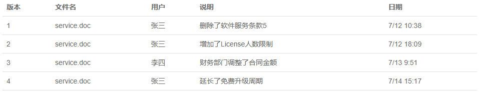
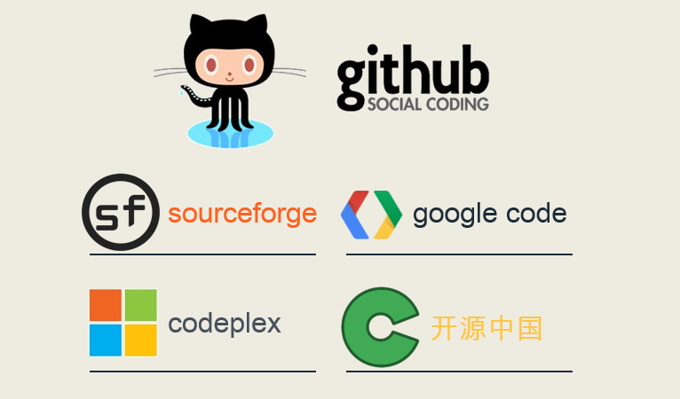

# Git基础
---
## 1.Git课程说明

### 前言
	
	Git的诞生

		很多人都知道，Linus在1991年创建了开源的Linux，从此，Linux系统不断发展，已经成为最大的服务器系统软件了。

		Linus虽然创建了Linux，但Linux的壮大是靠全世界热心的志愿者参与的，这么多人在世界各地为Linux编写代码，那Linux的代码是如何管理的呢？

		事实是，在2002年以前，世界各地的志愿者把源代码文件通过diff的方式发给Linus，然后由Linus本人通过手工方式合并代码！

		你也许会想，为什么Linus不把Linux代码放到版本控制系统里呢？不是有CVS、SVN这些免费的版本控制系统吗？因为Linus坚定地反对CVS和SVN，这些集中式的版本控制系统不但速度慢，而且必须联网才能使用。有一些商用的版本控制系统，虽然比CVS、SVN好用，但那是付费的，和Linux的开源精神不符。

		不过，到了2002年，Linux系统已经发展了十年了，代码库之大让Linus很难继续通过手工方式管理了，社区的弟兄们也对这种方式表达了强烈不满，于是Linus选择了一个商业的版本控制系统BitKeeper，BitKeeper的东家BitMover公司出于人道主义精神，授权Linux社区免费使用这个版本控制系统。

		安定团结的大好局面在2005年就被打破了，原因是Linux社区牛人聚集，不免沾染了一些梁山好汉的江湖习气。开发Samba的Andrew试图破解BitKeeper的协议（这么干的其实也不只他一个），被BitMover公司发现了（监控工作做得不错！），于是BitMover公司怒了，要收回Linux社区的免费使用权。

		Linus可以向BitMover公司道个歉，保证以后严格管教弟兄们，嗯，这是不可能的。实际情况是这样的：

		Linus花了两周时间自己用C写了一个分布式版本控制系统，这就是Git！一个月之内，Linux系统的源码已经由Git管理了！牛是怎么定义的呢？大家可以体会一下。

		Git迅速成为最流行的分布式版本控制系统，尤其是2008年，GitHub网站上线了，它为开源项目免费提供Git存储，无数开源项目开始迁移至GitHub，包括jQuery，PHP，Ruby等等。

		历史就是这么偶然，如果不是当年BitMover公司威胁Linux社区，可能现在我们就没有免费而超级好用的Git了

	集中式vs分布式

		Linus一直痛恨的CVS及SVN都是集中式的版本控制系统，而Git是分布式版本控制系统，集中式和分布式版本控制系统有什么区别呢？

		先说集中式版本控制系统，版本库是集中存放在中央服务器的，而干活的时候，用的都是自己的电脑，所以要先从中央服务器取得最新的版本，然后开始干活，干完活了，再把自己的活推送给中央服务器。中央服务器就好比是一个图书馆，你要改一本书，必须先从图书馆借出来，然后回到家自己改，改完了，再放回图书馆。

		集中式版本控制系统最大的毛病就是必须联网才能工作，如果在局域网内还好，带宽够大，速度够快，可如果在互联网上，遇到网速慢的话，可能提交一个10M的文件就需要5分钟，这还不得把人给憋死啊。

		那分布式版本控制系统与集中式版本控制系统有何不同呢？首先，分布式版本控制系统根本没有“中央服务器”，每个人的电脑上都是一个完整的版本库，这样，你工作的时候，就不需要联网了，因为版本库就在你自己的电脑上。既然每个人电脑上都有一个完整的版本库，那多个人如何协作呢？比方说你在自己电脑上改了文件A，你的同事也在他的电脑上改了文件A，这时，你们俩之间只需把各自的修改推送给对方，就可以互相看到对方的修改了。

		和集中式版本控制系统相比，分布式版本控制系统的安全性要高很多，因为每个人电脑里都有完整的版本库，某一个人的电脑坏掉了不要紧，随便从其他人那里复制一个就可以了。而集中式版本控制系统的中央服务器要是出了问题，所有人都没法干活了。

		在实际使用分布式版本控制系统的时候，其实很少在两人之间的电脑上推送版本库的修改，因为可能你们俩不在一个局域网内，两台电脑互相访问不了，也可能今天你的同事病了，他的电脑压根没有开机。因此，分布式版本控制系统通常也有一台充当“中央服务器”的电脑，但这个服务器的作用仅仅是用来方便“交换”大家的修改，没有它大家也一样干活，只是交换修改不方便而已。

		当然，Git的优势不单是不必联网这么简单，后面我们还会看到Git极其强大的分支管理，把SVN等远远抛在了后面。

		CVS作为最早的开源而且免费的集中式版本控制系统，直到现在还有不少人在用。由于CVS自身设计的问题，会造成提交文件不完整，版本库莫名其妙损坏的情况。同样是开源而且免费的SVN修正了CVS的一些稳定性问题，是目前用得最多的集中式版本库控制系统。

		除了免费的外，还有收费的集中式版本控制系统，比如IBM的ClearCase（以前是Rational公司的，被IBM收购了），特点是安装比Windows还大，运行比蜗牛还慢，能用ClearCase的一般是世界500强，他们有个共同的特点是财大气粗，或者人傻钱多。

		微软自己也有一个集中式版本控制系统叫VSS，集成在Visual Studio中。由于其反人类的设计，连微软自己都不好意思用了。

		分布式版本控制系统除了Git以及促使Git诞生的BitKeeper外，还有类似Git的Mercurial和Bazaar等。这些分布式版本控制系统各有特点，但最快、最简单也最流行的依然是Git！	

### 1.1 是什么?
		Github其实就是一个IT技术人员的网站,主要作用就是用来托管我们的网站或者代码项目.
		
		首先,Github是由两个单词组成,Git和hub组件,那么Git是什么?
		Git是一个版本控制系统,也成为scm.
	
		那么什么又是版本控制系统?
		如果你用Microsoft Word写过长篇大论，那你一定有这样的经历：	
		想删除一个段落，又怕将来想恢复找不回来怎么办？有办法，先把当前文件“另存为……”一个新的Word文件，再接着改，改到一定程度，再“另存为……”一个新文件，这样一直改下去，最后你的Word文档变成了这样：

		过了一周，你想找回被删除的文字，但是已经记不清删除前保存在哪个文件里了，只好一个一个文件去找，真麻烦。

		看着一堆乱七八糟的文件，想保留最新的一个，然后把其他的删掉，又怕哪天会用上，还不敢删，真郁闷。

		更要命的是，有些部分需要你的财务同事帮助填写，于是你把文件Copy到U盘里给她（也可能通过Email发送一份给她），然后，你继续修改Word文件。一天后，同事再把Word文件传给你，此时，你必须想想，发给她之后到你收到她的文件期间，你作了哪些改动，得把你的改动和她的部分合并，真困难。

		于是你想，如果有一个软件，不但能自动帮我记录每次文件的改动，还可以让同事协作编辑，这样就不用自己管理一堆类似的文件了，也不需要把文件传来传去。如果想查看某次改动，只需要在软件里瞄一眼就可以，岂不是很方便？

		这个软件用起来就应该像这个样子，能记录每次文件的改动：
		

		
		这样，你就结束了手动管理多个“版本”的史前时代，进入到版本控制的20世纪。

### 1.2 有那些好处?

	理由一:
		Github上由很多大牛,比如国内的像百度,腾讯,阿里这些大公司,里面的跟多工程师在Github上面都有账号,也就是说他们都有个人主页,有空的话大家可以逛一逛,关注一下,说不定还能搞个内推什么的.
	
	理由二:
		Github上面可以接触到最新的,最前沿的技术,因为我们知道任何的软件或者产品在上线之前都有开发和测试的过程,Github上你可以接触到这些软件的初始状态,中间状态,以及发布状态,你可以第一时间两届到产品的动向,而且你可以通过Github上面每年发布的统计数据,你可以知道那些技术是最火的,保证捏能跟上这些技术,而不是学了一堆小众过了时的技术,这个问题相信也是我们每个搞IT的人特别关注的.

	理由三：
		GitHub 是基于 Git 版本控制工具的，任何一个软件从无到有的全部过程，或者说软件从无到有的每个版本，它是怎么发展过来的，全都一览无遗。从这里面我们可以学到开发的技术，包括编程语言、单元测试、设计思想、编码规范、项目的协调组织以及流程，等等。而且因为 GitHub 是版本控制，可以很好的管理程序代码或者文档的每个历史状态，相当于我们每天刷的微博或者微信朋友圈。这些社交媒体工具可以记录我们的生活点滴，而 GitHub 可以记录我们的技术发展，如果你是一个刚上大一的新生，如果能把学习的每门课程，从 C 语言、数据结构开始，把每门课程的练习代码放到 GitHub 上，四年下来也是一个很好的积累。

	理由四：
		GitHub 是开源的，开源就意味着所有项目的代码和文档，甚至中间过程对我们都是开放的。我们从这些项目中可以找一些感兴趣的项目参与其中，可以利用这些项目来提升我们的技术，积累我们的项目经验。很多大学生毕业的时候，因为没有项目经验而被企业拒之门外，试想一下，如果能够在大学期间，从大一就开始接触了了解 Github，在大学毕业的时候在 GitHub 上已经有一些参与项目的经验，那会对我们的未来有多大的帮助啊。如果你想做程序员，你可以在开源项目中贡献代码，如果你想做测试工程师，你可以在开源项目中提 bug 缺陷。而且，GitHub 上确实有很多猎头在关注着你，有很多靠谱的工作机会等待着你，前提是你需要在 GitHub 上安家，然后把你对 IT 技术的学习过程用 GitHub 管理起来。利用 GitHub 在个人职业发展上，走向成功的案例举不胜举.

	理由五：
		GitHub 不仅托管的项目不仅可以是软件包或者程序代码，也可以是文档教程。所以，我对 GitHub 的资料，分两个大类，一个程序代码，二是自然语言代码。程序代码很好理解，大家都多少接触过编程，了解一门或多门编程语言。自然语言代码，其实就是自然语言编写的文档资料。即使我们因为程序语言掌握的不好，不太能一上来参与到开源项目中去贡献代码。但是，很多技术大牛在 GitHub 上做了很多非常棒的入门教程，帮助初学者。像我就用 GitHub 做课程开发，大家可以在我的 GitHub courses 仓库中，找到很多课程的资料页面。有的人在 GitHub 上写书，我这里搜藏了两个大牛写的 python 书，都可以完全免费的在线阅读。还有阮一峰老师写的 JavaScript 书，等等。所以 GitHub 是一个非常丰富的学习资料仓库。大家如果不接触 GitHub，没有掌握 GitHub 这个强大的工具，这些优质的学习资料，就跟大家失之交臂了，这是非常可惜的一件事情。

	最后，用一句话来总结一下这个话题。那就是，一旦你掌握了 GitHub 这个强大的工具，你的 IT 技术水平或者职业发展就进入了快车道。
	
	
### 1.3 优势?

	只支持 Git
	完整协议支持
	在线文件编辑
	社交网络元素
	特色工作模式
	私有仓库托管
	Ruby on Rails

### 1.4 总体安排

	Git基础
	Git进阶
	Git团队协作

### 1.5 基础安排

### 1.6 教学目标
	
	实名注册 Github 账户
	点亮个人头像
	完善个人资料
	能够在 Github 上搜索资料
	搜索人
	搜索项目
	能够评估人和项目的活跃度
	掌握 Github 社交化
	Star 收藏项目
	Follow 关注高手
	能够创建 Github 远程仓库
	能够删除 Github 远程仓库
	能够建立本地仓库
	能够把本地仓库和远程仓库建立关联
	能够在本地仓库和远成仓库之间 push 和 pull

### 1.7 开源社区

### 1.8 参考资料

### 1.9 作业任务

#### 了解Github

	要求：
		1. 阅读维基百科的 Github 词条；
		2. 阅读百度百科的 Github 词条；
		3. 浏览课程资料页面；
		4. 浏览 Github 2018 年度报告；

## 2.注册Github账号

### 2.1 注册账号

	1. 访问Github官网 `https://github.com`      
    2. 点击Sign up进入到注册页面
    3. 输入你要注册的用户名(建议用真实的姓名)
    4. 输入你的邮箱地址(建议使用qq邮箱)
    5. 输入你的账户密码
    6. 点击Create an account按钮
    7. 进入第二步,选择创建公开免费的仓库
    8. 点击按钮
    9. 重新登录
  
### 2.2 验证邮件地址

	1. 注册完成之后,GitHub会给注册的邮箱发送一封邮件
    2. 打开你的邮箱,查看邮件的内容
    3. 点击验证
### 2.3 完善个人资料

	1. 输入名称
    2. 输入邮箱
    3. 输入简介
    4. 输入地址(网址)
    5. 输入单位(公司名称或者学校)
    6. 输入所在地
    7. 回到个人主页,就会显示设置的个人资料
### 2.4 点亮头像
	1. 点击Upload new picture上传本地头像
	2. 使用Gravatar 全球大头贴
	
### 2.5 作业任务

	要求：
		1. 真实姓名；
		2. 真实头像；
		3. 职业信息；
		4. 单位信息；
		5. 位置信息
	
## 3.Github个人主页

### 3.1 Github要素

	1. 人/组织
	2. 仓库/项目
	
### 3.2 Overview

	1. 个人信息
	2. 主要的仓库
	3. 活跃度信息

### 3.3 Repositories

	1. 自己的仓库
	2. 参与的仓库

### 3.4 Stars(收藏)

### 3.5 Watch(关注项目)

### 3.6 Followers(关注我的人)

### 3.7 Following(我关注的人)

### 3.8 Github数字仪表盘

	1. https://github.com
	2. 登录状态下

### 3.9 作业任务

####　Github社交
	
	要求:
		1. Follow（关注）YangMr
		2. Star（收藏）courses 项目
		3. Follow（关注）其他人
		4. Star（收藏）其他项目
		5. Watch（关注）courses 项目

## 4.Github挖宝(搜索)

### 4.1 搜索范围

	1. 搜索Github
	2. 搜索仓库

### 4.2 搜索内容

	1. 找项目
	2. 找人

### 4.3 搜索结果页面

### 4.4 搜索中文资料

### 4.5 作业任务

#### Github挖宝

	要求:
		1. 搜索活跃的大牛
		2. 查找感兴趣的项目

## 5.Github仓库

### 5.1 创建仓库

### 5.2 Code视图

### 5.3 Settings设置

### 5.4 删除仓库

### 5.5 Github Page

### 5.6 作业任务

#### Github仓库

	要求:
		1. 浏览courses仓库
		2. 浏览demo仓库
		3. 设置Github Page
		4. 在demo仓库中操作
		5. 删除demo仓库

## 6.Git工具

### 6.1 Git工具分类

	命令行:
		Bash, Cmd, PowerShell等
	GUI:
		Git GUI,Github Desktop等
	IDE集成:
		Visual Studio,Eclipse,Intellij IDE等

### 6.2 Git下载及安装

### 6.3 Git Bash设置
	
	光标颜色
     	默认：白色，改成：绿色

	光标形状
     	默认：下划线，改成：块状

	光标闪烁
     	默认：闪烁，改成：不闪

	字体大小
    	 默认：9号字，改成：14号

### 6.4 设置Git参数

	显示当前的 Git 配置
		git config --list

	设置提交仓库时的用户名信息
		git config --global user.name “用户名”

	设置提交仓库时的邮箱信息
		git config --global user.email “邮箱地址”

### 6.5 Bash命令体验
	
	1. cd	   change directory
	2. mkdir   make directory
	3. pwd	   print working directory
	4. mv	   move
	5. cp	   copy
	6. rm      remove
	7. echo	   

### 6.6 作业任务

#### 下载并安装Git工具
	
	要求：
		1. 百度搜索 Git 并下载；
		2. 安装 Git 工具；
		3. Git Bash 中运行 git --version 验证安装是否成功；
		4. 配置 Git Bash 环境；

## 7.补充:Git Bash操作的四个坑

## 8.Git命令上

### 8.1 说明：       

    1. Workspace：工作区      
    2. Index / Stage：暂存区     
    3. Repository：仓库区（或本地仓库）

### 8.2 新建代码仓库

	1. 在当前目录新建一个代码仓库  
		git init
	2. 下载一个项目和它的整个代码历史
		url 格式: https://github.com/[userName]/reposName
		git clone [url]
### 8.3 添加删除文件

		1. 添加指定文件到暂存区
			git add [file1] [file2]
		2. 删除工作区文件,并且将这次删除放入暂存区
			git rm [file1] [file2]
		3. 改名文件,并且将这个改名放入暂存区
			git mv [file-origin] [file-renamed]
### 8.4 代码提交

		1. 提交暂存区到仓库
			git commit –m [message]
		2. 直接从工作区提交到仓库-前提该文件已经有仓库中的历史版本
			git commit –a –m [message]
### 8.5 查看信息

		1. 显示变更信息
			git status
		2. 显示当前分支的历史版本
			git log
			git log --oneline
## 9.Git命令下

       
### 9.1 说明：  

	1. Workspace：工作区  
	2. Index / Stage：暂存区  
	3. Repository：仓库区（或本地仓库）  
	4. Remote：远程仓库，例如：Github    
    
### 9.2 同步远程仓库  

	增加远程仓库，并命名
		git remote add [shortname] [url]

	将本地的提交推送到远程仓库
		git push [remote] [branch]

	将远程仓库的提交拉下到本地
		git pull [remote] [branch]

## 9.3 作业任务

### 本地练习 Git

	要求：
		1. 在自己电脑的 C： 盘根目录，建立文件夹：hello-git；
		2. 在 hello-git 中初始化仓库；
		3. 在 hello-git 中创建 README.md 文件，文件内容随意；
		4. 把 README.md 文件，提交到本地仓库中；
		5. 在自己的 Github 账户中创建 hello-git 空仓库；
		6. 把自己本地的 hello-git 仓库与远程（上一步）hello-git 仓库关联上；
		7. 把本地的 hello-git 仓库中的内容 push（同步）到远程 hello-git 仓库中；
		8. 在 Github 的 hello-git 仓库中，验证存在文件：README.md；
		9. 
### 在线练习 Git

	要求：
		1. 网址：https://try.github.io/
		2. 阅读该网站的提示信息；
		3. 打通所有关卡；
		4. 理解并记忆每关的命令

	
