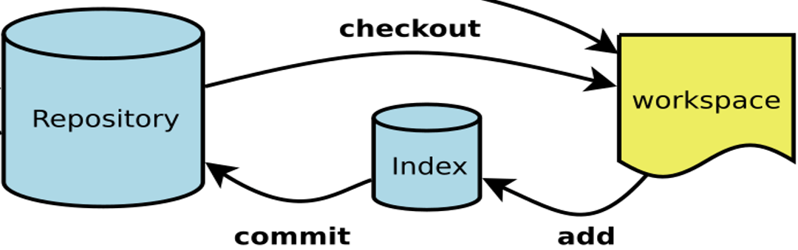
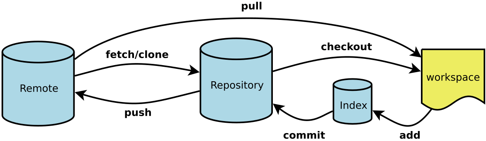
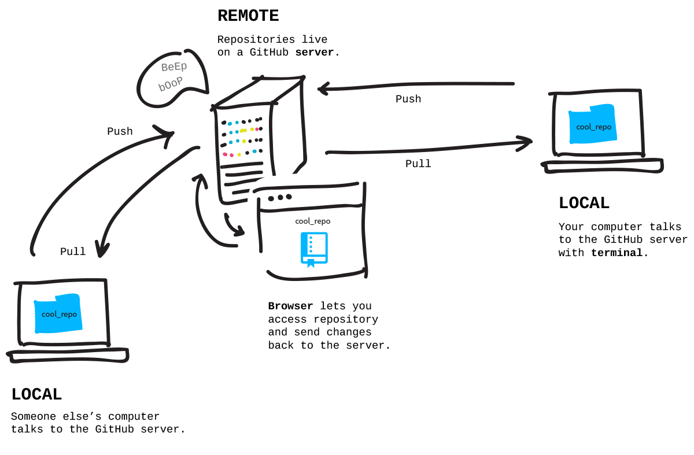

# Git基础
---
## 1.Git课程说明

## 2.注册Github账号

## 3.Github个人主页

## 4.Github挖宝

## 5.Github仓库

## 6.Git工具

## 7.补充:Git Bash操作的四个坑

## 8.Git命令上

### 说明：       

    1. Workspace：工作区      
    2. Index / Stage：暂存区     
    3. Repository：仓库区（或本地仓库）

### 新建代码仓库
	1. 在当前目录新建一个代码仓库  
		git init
	2. 下载一个项目和它的整个代码历史
		url 格式: https://github.com/[userName]/reposName
		git clone [url]
### 添加删除文件
		1. 添加指定文件到暂存区
			git add [file1] [file2]
		2. 删除工作区文件,并且将这次删除放入暂存区
			git rm [file1] [file2]
		3. 改名文件,并且将这个改名放入暂存区
			git mv [file-origin] [file-renamed]
### 代码提交
		1. 提交暂存区到仓库
			git commit –m [message]
		2. 直接从工作区提交到仓库-前提该文件已经有仓库中的历史版本
			git commit –a –m [message]
### 查看信息
		1. 显示变更信息
			git status
		2. 显示当前分支的历史版本
			git log
			git log --oneline
## 9.Git命令下
       
### 说明：  
	1. Workspace：工作区  
	2. Index / Stage：暂存区  
	3. Repository：仓库区（或本地仓库）  
	4. Remote：远程仓库，例如：Github    
    
### 同步远程仓库  
	增加远程仓库，并命名
		git remote add [shortname] [url]

	将本地的提交推送到远程仓库
		git push [remote] [branch]

	将远程仓库的提交拉下到本地
		git pull [remote] [branch]

## 作业任务
### 本地练习 Git
	要求：
		1. 在自己电脑的 C： 盘根目录，建立文件夹：hello-git；
		2. 在 hello-git 中初始化仓库；
		3. 在 hello-git 中创建 README.md 文件，文件内容随意；
		4. 把 README.md 文件，提交到本地仓库中；
		5. 在自己的 Github 账户中创建 hello-git 空仓库；
		6. 把自己本地的 hello-git 仓库与远程（上一步）hello-git 仓库关联上；
		7. 把本地的 hello-git 仓库中的内容 push（同步）到远程 hello-git 仓库中；
		8. 在 Github 的 hello-git 仓库中，验证存在文件：README.md；
### 在线练习 Git
	要求：
		1. 网址：https://try.github.io/
		2. 阅读该网站的提示信息；
		3. 打通所有关卡；
		4. 理解并记忆每关的命令

	
